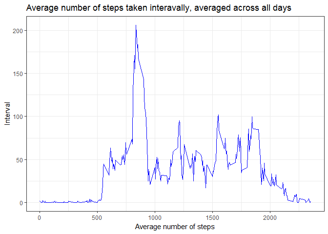
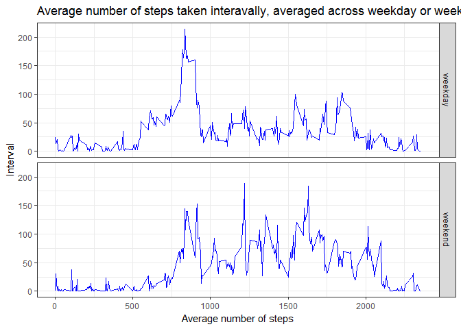

## Load libraries and set defaults
Set English locale for appropriate names of days.  

```r
Sys.setlocale("LC_TIME", "English")
```

Load libraries for plotting, data processing and imputing.  

```r
library(ggplot2)
library(dplyr)
library(mice)
library(kableExtra)
library(knitr)
```

## Loading and preprocessing the data  
Download data to local zip-file. Read data to dataframe including header and converting second column to Date format.  

```r
download.file("https://d396qusza40orc.cloudfront.net/repdata%2Fdata%2Factivity.zip", "activity.zip")
df <- read.table(unz("activity.zip", "activity.csv"),
                 sep = ",",
                 header = TRUE,
                 colClasses = c("numeric", "Date", "numeric"))
```

## What is mean total number of steps taken per day?
Calculate the total number of steps taken per day ignoring NA values

```r
daily <- df %>% 
    group_by(date) %>% 
    summarise(Total = sum(steps, na.rm = TRUE),
              Average = mean(steps, na.rm = TRUE), 
              Median = median(steps, na.rm = TRUE))
```

Plot histogram using GGplot and 

```r
g <- ggplot(data = daily, aes(x = Total, fill = I("blue")))
g + geom_histogram(bins = 50) + theme_bw() + labs(y = "Days", x = "Steps", title = "Total number of steps taken each day")
```

<!-- -->

Table of mean and median of the total number of steps taken per day

```r
kable(daily[,c(1, 3, 4)], "html") %>%
  kable_styling(bootstrap_options = "striped", full_width = F)
```

<table class="table table-striped" style="width: auto !important; margin-left: auto; margin-right: auto;">
<thead><tr>
<th style="text-align:left;"> date </th>
   <th style="text-align:right;"> Average </th>
   <th style="text-align:right;"> Median </th>
  </tr></thead>
<tbody>
<tr>
<td style="text-align:left;"> 2012-10-01 </td>
   <td style="text-align:right;"> NaN </td>
   <td style="text-align:right;"> NA </td>
  </tr>
<tr>
<td style="text-align:left;"> 2012-10-02 </td>
   <td style="text-align:right;"> 0.4375000 </td>
   <td style="text-align:right;"> 0 </td>
  </tr>
<tr>
<td style="text-align:left;"> 2012-10-03 </td>
   <td style="text-align:right;"> 39.4166667 </td>
   <td style="text-align:right;"> 0 </td>
  </tr>
<tr>
<td style="text-align:left;"> 2012-10-04 </td>
   <td style="text-align:right;"> 42.0694444 </td>
   <td style="text-align:right;"> 0 </td>
  </tr>
<tr>
<td style="text-align:left;"> 2012-10-05 </td>
   <td style="text-align:right;"> 46.1597222 </td>
   <td style="text-align:right;"> 0 </td>
  </tr>
<tr>
<td style="text-align:left;"> 2012-10-06 </td>
   <td style="text-align:right;"> 53.5416667 </td>
   <td style="text-align:right;"> 0 </td>
  </tr>
<tr>
<td style="text-align:left;"> 2012-10-07 </td>
   <td style="text-align:right;"> 38.2465278 </td>
   <td style="text-align:right;"> 0 </td>
  </tr>
<tr>
<td style="text-align:left;"> 2012-10-08 </td>
   <td style="text-align:right;"> NaN </td>
   <td style="text-align:right;"> NA </td>
  </tr>
<tr>
<td style="text-align:left;"> 2012-10-09 </td>
   <td style="text-align:right;"> 44.4826389 </td>
   <td style="text-align:right;"> 0 </td>
  </tr>
<tr>
<td style="text-align:left;"> 2012-10-10 </td>
   <td style="text-align:right;"> 34.3750000 </td>
   <td style="text-align:right;"> 0 </td>
  </tr>
<tr>
<td style="text-align:left;"> 2012-10-11 </td>
   <td style="text-align:right;"> 35.7777778 </td>
   <td style="text-align:right;"> 0 </td>
  </tr>
<tr>
<td style="text-align:left;"> 2012-10-12 </td>
   <td style="text-align:right;"> 60.3541667 </td>
   <td style="text-align:right;"> 0 </td>
  </tr>
<tr>
<td style="text-align:left;"> 2012-10-13 </td>
   <td style="text-align:right;"> 43.1458333 </td>
   <td style="text-align:right;"> 0 </td>
  </tr>
<tr>
<td style="text-align:left;"> 2012-10-14 </td>
   <td style="text-align:right;"> 52.4236111 </td>
   <td style="text-align:right;"> 0 </td>
  </tr>
<tr>
<td style="text-align:left;"> 2012-10-15 </td>
   <td style="text-align:right;"> 35.2048611 </td>
   <td style="text-align:right;"> 0 </td>
  </tr>
<tr>
<td style="text-align:left;"> 2012-10-16 </td>
   <td style="text-align:right;"> 52.3750000 </td>
   <td style="text-align:right;"> 0 </td>
  </tr>
<tr>
<td style="text-align:left;"> 2012-10-17 </td>
   <td style="text-align:right;"> 46.7083333 </td>
   <td style="text-align:right;"> 0 </td>
  </tr>
<tr>
<td style="text-align:left;"> 2012-10-18 </td>
   <td style="text-align:right;"> 34.9166667 </td>
   <td style="text-align:right;"> 0 </td>
  </tr>
<tr>
<td style="text-align:left;"> 2012-10-19 </td>
   <td style="text-align:right;"> 41.0729167 </td>
   <td style="text-align:right;"> 0 </td>
  </tr>
<tr>
<td style="text-align:left;"> 2012-10-20 </td>
   <td style="text-align:right;"> 36.0937500 </td>
   <td style="text-align:right;"> 0 </td>
  </tr>
<tr>
<td style="text-align:left;"> 2012-10-21 </td>
   <td style="text-align:right;"> 30.6284722 </td>
   <td style="text-align:right;"> 0 </td>
  </tr>
<tr>
<td style="text-align:left;"> 2012-10-22 </td>
   <td style="text-align:right;"> 46.7361111 </td>
   <td style="text-align:right;"> 0 </td>
  </tr>
<tr>
<td style="text-align:left;"> 2012-10-23 </td>
   <td style="text-align:right;"> 30.9652778 </td>
   <td style="text-align:right;"> 0 </td>
  </tr>
<tr>
<td style="text-align:left;"> 2012-10-24 </td>
   <td style="text-align:right;"> 29.0104167 </td>
   <td style="text-align:right;"> 0 </td>
  </tr>
<tr>
<td style="text-align:left;"> 2012-10-25 </td>
   <td style="text-align:right;"> 8.6527778 </td>
   <td style="text-align:right;"> 0 </td>
  </tr>
<tr>
<td style="text-align:left;"> 2012-10-26 </td>
   <td style="text-align:right;"> 23.5347222 </td>
   <td style="text-align:right;"> 0 </td>
  </tr>
<tr>
<td style="text-align:left;"> 2012-10-27 </td>
   <td style="text-align:right;"> 35.1354167 </td>
   <td style="text-align:right;"> 0 </td>
  </tr>
<tr>
<td style="text-align:left;"> 2012-10-28 </td>
   <td style="text-align:right;"> 39.7847222 </td>
   <td style="text-align:right;"> 0 </td>
  </tr>
<tr>
<td style="text-align:left;"> 2012-10-29 </td>
   <td style="text-align:right;"> 17.4236111 </td>
   <td style="text-align:right;"> 0 </td>
  </tr>
<tr>
<td style="text-align:left;"> 2012-10-30 </td>
   <td style="text-align:right;"> 34.0937500 </td>
   <td style="text-align:right;"> 0 </td>
  </tr>
<tr>
<td style="text-align:left;"> 2012-10-31 </td>
   <td style="text-align:right;"> 53.5208333 </td>
   <td style="text-align:right;"> 0 </td>
  </tr>
<tr>
<td style="text-align:left;"> 2012-11-01 </td>
   <td style="text-align:right;"> NaN </td>
   <td style="text-align:right;"> NA </td>
  </tr>
<tr>
<td style="text-align:left;"> 2012-11-02 </td>
   <td style="text-align:right;"> 36.8055556 </td>
   <td style="text-align:right;"> 0 </td>
  </tr>
<tr>
<td style="text-align:left;"> 2012-11-03 </td>
   <td style="text-align:right;"> 36.7048611 </td>
   <td style="text-align:right;"> 0 </td>
  </tr>
<tr>
<td style="text-align:left;"> 2012-11-04 </td>
   <td style="text-align:right;"> NaN </td>
   <td style="text-align:right;"> NA </td>
  </tr>
<tr>
<td style="text-align:left;"> 2012-11-05 </td>
   <td style="text-align:right;"> 36.2465278 </td>
   <td style="text-align:right;"> 0 </td>
  </tr>
<tr>
<td style="text-align:left;"> 2012-11-06 </td>
   <td style="text-align:right;"> 28.9375000 </td>
   <td style="text-align:right;"> 0 </td>
  </tr>
<tr>
<td style="text-align:left;"> 2012-11-07 </td>
   <td style="text-align:right;"> 44.7326389 </td>
   <td style="text-align:right;"> 0 </td>
  </tr>
<tr>
<td style="text-align:left;"> 2012-11-08 </td>
   <td style="text-align:right;"> 11.1770833 </td>
   <td style="text-align:right;"> 0 </td>
  </tr>
<tr>
<td style="text-align:left;"> 2012-11-09 </td>
   <td style="text-align:right;"> NaN </td>
   <td style="text-align:right;"> NA </td>
  </tr>
<tr>
<td style="text-align:left;"> 2012-11-10 </td>
   <td style="text-align:right;"> NaN </td>
   <td style="text-align:right;"> NA </td>
  </tr>
<tr>
<td style="text-align:left;"> 2012-11-11 </td>
   <td style="text-align:right;"> 43.7777778 </td>
   <td style="text-align:right;"> 0 </td>
  </tr>
<tr>
<td style="text-align:left;"> 2012-11-12 </td>
   <td style="text-align:right;"> 37.3784722 </td>
   <td style="text-align:right;"> 0 </td>
  </tr>
<tr>
<td style="text-align:left;"> 2012-11-13 </td>
   <td style="text-align:right;"> 25.4722222 </td>
   <td style="text-align:right;"> 0 </td>
  </tr>
<tr>
<td style="text-align:left;"> 2012-11-14 </td>
   <td style="text-align:right;"> NaN </td>
   <td style="text-align:right;"> NA </td>
  </tr>
<tr>
<td style="text-align:left;"> 2012-11-15 </td>
   <td style="text-align:right;"> 0.1423611 </td>
   <td style="text-align:right;"> 0 </td>
  </tr>
<tr>
<td style="text-align:left;"> 2012-11-16 </td>
   <td style="text-align:right;"> 18.8923611 </td>
   <td style="text-align:right;"> 0 </td>
  </tr>
<tr>
<td style="text-align:left;"> 2012-11-17 </td>
   <td style="text-align:right;"> 49.7881944 </td>
   <td style="text-align:right;"> 0 </td>
  </tr>
<tr>
<td style="text-align:left;"> 2012-11-18 </td>
   <td style="text-align:right;"> 52.4652778 </td>
   <td style="text-align:right;"> 0 </td>
  </tr>
<tr>
<td style="text-align:left;"> 2012-11-19 </td>
   <td style="text-align:right;"> 30.6979167 </td>
   <td style="text-align:right;"> 0 </td>
  </tr>
<tr>
<td style="text-align:left;"> 2012-11-20 </td>
   <td style="text-align:right;"> 15.5277778 </td>
   <td style="text-align:right;"> 0 </td>
  </tr>
<tr>
<td style="text-align:left;"> 2012-11-21 </td>
   <td style="text-align:right;"> 44.3993056 </td>
   <td style="text-align:right;"> 0 </td>
  </tr>
<tr>
<td style="text-align:left;"> 2012-11-22 </td>
   <td style="text-align:right;"> 70.9270833 </td>
   <td style="text-align:right;"> 0 </td>
  </tr>
<tr>
<td style="text-align:left;"> 2012-11-23 </td>
   <td style="text-align:right;"> 73.5902778 </td>
   <td style="text-align:right;"> 0 </td>
  </tr>
<tr>
<td style="text-align:left;"> 2012-11-24 </td>
   <td style="text-align:right;"> 50.2708333 </td>
   <td style="text-align:right;"> 0 </td>
  </tr>
<tr>
<td style="text-align:left;"> 2012-11-25 </td>
   <td style="text-align:right;"> 41.0902778 </td>
   <td style="text-align:right;"> 0 </td>
  </tr>
<tr>
<td style="text-align:left;"> 2012-11-26 </td>
   <td style="text-align:right;"> 38.7569444 </td>
   <td style="text-align:right;"> 0 </td>
  </tr>
<tr>
<td style="text-align:left;"> 2012-11-27 </td>
   <td style="text-align:right;"> 47.3819444 </td>
   <td style="text-align:right;"> 0 </td>
  </tr>
<tr>
<td style="text-align:left;"> 2012-11-28 </td>
   <td style="text-align:right;"> 35.3576389 </td>
   <td style="text-align:right;"> 0 </td>
  </tr>
<tr>
<td style="text-align:left;"> 2012-11-29 </td>
   <td style="text-align:right;"> 24.4687500 </td>
   <td style="text-align:right;"> 0 </td>
  </tr>
<tr>
<td style="text-align:left;"> 2012-11-30 </td>
   <td style="text-align:right;"> NaN </td>
   <td style="text-align:right;"> NA </td>
  </tr>
</tbody>
</table>

## What is the average daily activity pattern?  
Calculate the total number of steps taken per interval

```r
intervaly <- df %>% 
    group_by(interval) %>% 
    summarise(avg = mean(steps, na.rm = TRUE))
```

Make a time series plot of the 5-minute interval and the average number of steps

```r
g <- ggplot(data = intervaly, aes(x = interval, y = avg))
g + geom_line(color = "blue") + theme_bw() + labs(y = "Interval", x = "Average number of steps", title = "Average number of steps taken interavally, averaged across all days")
```

<!-- -->

Use Which.max to find index of 5-minute interval, contains the maximum number of steps. Then subset dataframe to find number of indexed interval.

```r
which.max(intervaly$avg)
```

```
## [1] 104
```

```r
intervaly[which.max(intervaly$avg), 1]
```

```
## # A tibble: 1 x 1
##   interval
##      <dbl>
## 1      835
```

## Imputing missing values  
Calculate total number of missing values in the dataset

```r
sum(is.na(df))
```

```
## [1] 2304
```

Use predictive mean matching (from "mice package) to filling in all of the missing values in the dataset. For simplicity (and speed) just one result dataframe with 10 steps. Additionally, double Date conversion for properly use of "mice".

```r
df_imp <- df %>% 
    mutate(date = as.factor(date)) %>% 
    mice(m = 1, maxit = 10, method = 'pmm', seed = 500) %>%
    complete(1) %>% 
    mutate(date = as.Date(date))
```

Check if there are any NA's left

```r
sum(is.na(df_imp))
```

```
## [1] 0
```

Calculate the total number of steps taken per day (filled NA values)

```r
daily_imp <- df_imp %>% 
  group_by(date) %>% 
  summarise(Total = sum(steps, na.rm = TRUE), 
            Average = mean(steps, na.rm = TRUE), 
            Median = median(steps, na.rm = TRUE))
```

Plot histogram using GGplot and 

```r
g <- ggplot(data = daily_imp, aes(x = Total, fill = I("blue")))
g + geom_histogram(bins = 50) + theme_bw() + labs(y = "Days", x = "Steps", title = "Total number of steps taken each day")
```

<!-- -->

Table of mean and median of the total number of steps taken per day

```r
kable(daily_imp[,c(1, 3, 4)], "html") %>%
  kable_styling(bootstrap_options = "striped", full_width = F)
```

<table class="table table-striped" style="width: auto !important; margin-left: auto; margin-right: auto;">
<thead><tr>
<th style="text-align:left;"> date </th>
   <th style="text-align:right;"> Average </th>
   <th style="text-align:right;"> Median </th>
  </tr></thead>
<tbody>
<tr>
<td style="text-align:left;"> 2012-10-01 </td>
   <td style="text-align:right;"> 44.1875000 </td>
   <td style="text-align:right;"> 0 </td>
  </tr>
<tr>
<td style="text-align:left;"> 2012-10-02 </td>
   <td style="text-align:right;"> 0.4375000 </td>
   <td style="text-align:right;"> 0 </td>
  </tr>
<tr>
<td style="text-align:left;"> 2012-10-03 </td>
   <td style="text-align:right;"> 39.4166667 </td>
   <td style="text-align:right;"> 0 </td>
  </tr>
<tr>
<td style="text-align:left;"> 2012-10-04 </td>
   <td style="text-align:right;"> 42.0694444 </td>
   <td style="text-align:right;"> 0 </td>
  </tr>
<tr>
<td style="text-align:left;"> 2012-10-05 </td>
   <td style="text-align:right;"> 46.1597222 </td>
   <td style="text-align:right;"> 0 </td>
  </tr>
<tr>
<td style="text-align:left;"> 2012-10-06 </td>
   <td style="text-align:right;"> 53.5416667 </td>
   <td style="text-align:right;"> 0 </td>
  </tr>
<tr>
<td style="text-align:left;"> 2012-10-07 </td>
   <td style="text-align:right;"> 38.2465278 </td>
   <td style="text-align:right;"> 0 </td>
  </tr>
<tr>
<td style="text-align:left;"> 2012-10-08 </td>
   <td style="text-align:right;"> 40.0347222 </td>
   <td style="text-align:right;"> 0 </td>
  </tr>
<tr>
<td style="text-align:left;"> 2012-10-09 </td>
   <td style="text-align:right;"> 44.4826389 </td>
   <td style="text-align:right;"> 0 </td>
  </tr>
<tr>
<td style="text-align:left;"> 2012-10-10 </td>
   <td style="text-align:right;"> 34.3750000 </td>
   <td style="text-align:right;"> 0 </td>
  </tr>
<tr>
<td style="text-align:left;"> 2012-10-11 </td>
   <td style="text-align:right;"> 35.7777778 </td>
   <td style="text-align:right;"> 0 </td>
  </tr>
<tr>
<td style="text-align:left;"> 2012-10-12 </td>
   <td style="text-align:right;"> 60.3541667 </td>
   <td style="text-align:right;"> 0 </td>
  </tr>
<tr>
<td style="text-align:left;"> 2012-10-13 </td>
   <td style="text-align:right;"> 43.1458333 </td>
   <td style="text-align:right;"> 0 </td>
  </tr>
<tr>
<td style="text-align:left;"> 2012-10-14 </td>
   <td style="text-align:right;"> 52.4236111 </td>
   <td style="text-align:right;"> 0 </td>
  </tr>
<tr>
<td style="text-align:left;"> 2012-10-15 </td>
   <td style="text-align:right;"> 35.2048611 </td>
   <td style="text-align:right;"> 0 </td>
  </tr>
<tr>
<td style="text-align:left;"> 2012-10-16 </td>
   <td style="text-align:right;"> 52.3750000 </td>
   <td style="text-align:right;"> 0 </td>
  </tr>
<tr>
<td style="text-align:left;"> 2012-10-17 </td>
   <td style="text-align:right;"> 46.7083333 </td>
   <td style="text-align:right;"> 0 </td>
  </tr>
<tr>
<td style="text-align:left;"> 2012-10-18 </td>
   <td style="text-align:right;"> 34.9166667 </td>
   <td style="text-align:right;"> 0 </td>
  </tr>
<tr>
<td style="text-align:left;"> 2012-10-19 </td>
   <td style="text-align:right;"> 41.0729167 </td>
   <td style="text-align:right;"> 0 </td>
  </tr>
<tr>
<td style="text-align:left;"> 2012-10-20 </td>
   <td style="text-align:right;"> 36.0937500 </td>
   <td style="text-align:right;"> 0 </td>
  </tr>
<tr>
<td style="text-align:left;"> 2012-10-21 </td>
   <td style="text-align:right;"> 30.6284722 </td>
   <td style="text-align:right;"> 0 </td>
  </tr>
<tr>
<td style="text-align:left;"> 2012-10-22 </td>
   <td style="text-align:right;"> 46.7361111 </td>
   <td style="text-align:right;"> 0 </td>
  </tr>
<tr>
<td style="text-align:left;"> 2012-10-23 </td>
   <td style="text-align:right;"> 30.9652778 </td>
   <td style="text-align:right;"> 0 </td>
  </tr>
<tr>
<td style="text-align:left;"> 2012-10-24 </td>
   <td style="text-align:right;"> 29.0104167 </td>
   <td style="text-align:right;"> 0 </td>
  </tr>
<tr>
<td style="text-align:left;"> 2012-10-25 </td>
   <td style="text-align:right;"> 8.6527778 </td>
   <td style="text-align:right;"> 0 </td>
  </tr>
<tr>
<td style="text-align:left;"> 2012-10-26 </td>
   <td style="text-align:right;"> 23.5347222 </td>
   <td style="text-align:right;"> 0 </td>
  </tr>
<tr>
<td style="text-align:left;"> 2012-10-27 </td>
   <td style="text-align:right;"> 35.1354167 </td>
   <td style="text-align:right;"> 0 </td>
  </tr>
<tr>
<td style="text-align:left;"> 2012-10-28 </td>
   <td style="text-align:right;"> 39.7847222 </td>
   <td style="text-align:right;"> 0 </td>
  </tr>
<tr>
<td style="text-align:left;"> 2012-10-29 </td>
   <td style="text-align:right;"> 17.4236111 </td>
   <td style="text-align:right;"> 0 </td>
  </tr>
<tr>
<td style="text-align:left;"> 2012-10-30 </td>
   <td style="text-align:right;"> 34.0937500 </td>
   <td style="text-align:right;"> 0 </td>
  </tr>
<tr>
<td style="text-align:left;"> 2012-10-31 </td>
   <td style="text-align:right;"> 53.5208333 </td>
   <td style="text-align:right;"> 0 </td>
  </tr>
<tr>
<td style="text-align:left;"> 2012-11-01 </td>
   <td style="text-align:right;"> 38.5659722 </td>
   <td style="text-align:right;"> 0 </td>
  </tr>
<tr>
<td style="text-align:left;"> 2012-11-02 </td>
   <td style="text-align:right;"> 36.8055556 </td>
   <td style="text-align:right;"> 0 </td>
  </tr>
<tr>
<td style="text-align:left;"> 2012-11-03 </td>
   <td style="text-align:right;"> 36.7048611 </td>
   <td style="text-align:right;"> 0 </td>
  </tr>
<tr>
<td style="text-align:left;"> 2012-11-04 </td>
   <td style="text-align:right;"> 41.3611111 </td>
   <td style="text-align:right;"> 0 </td>
  </tr>
<tr>
<td style="text-align:left;"> 2012-11-05 </td>
   <td style="text-align:right;"> 36.2465278 </td>
   <td style="text-align:right;"> 0 </td>
  </tr>
<tr>
<td style="text-align:left;"> 2012-11-06 </td>
   <td style="text-align:right;"> 28.9375000 </td>
   <td style="text-align:right;"> 0 </td>
  </tr>
<tr>
<td style="text-align:left;"> 2012-11-07 </td>
   <td style="text-align:right;"> 44.7326389 </td>
   <td style="text-align:right;"> 0 </td>
  </tr>
<tr>
<td style="text-align:left;"> 2012-11-08 </td>
   <td style="text-align:right;"> 11.1770833 </td>
   <td style="text-align:right;"> 0 </td>
  </tr>
<tr>
<td style="text-align:left;"> 2012-11-09 </td>
   <td style="text-align:right;"> 37.4479167 </td>
   <td style="text-align:right;"> 0 </td>
  </tr>
<tr>
<td style="text-align:left;"> 2012-11-10 </td>
   <td style="text-align:right;"> 34.9965278 </td>
   <td style="text-align:right;"> 0 </td>
  </tr>
<tr>
<td style="text-align:left;"> 2012-11-11 </td>
   <td style="text-align:right;"> 43.7777778 </td>
   <td style="text-align:right;"> 0 </td>
  </tr>
<tr>
<td style="text-align:left;"> 2012-11-12 </td>
   <td style="text-align:right;"> 37.3784722 </td>
   <td style="text-align:right;"> 0 </td>
  </tr>
<tr>
<td style="text-align:left;"> 2012-11-13 </td>
   <td style="text-align:right;"> 25.4722222 </td>
   <td style="text-align:right;"> 0 </td>
  </tr>
<tr>
<td style="text-align:left;"> 2012-11-14 </td>
   <td style="text-align:right;"> 42.6875000 </td>
   <td style="text-align:right;"> 0 </td>
  </tr>
<tr>
<td style="text-align:left;"> 2012-11-15 </td>
   <td style="text-align:right;"> 0.1423611 </td>
   <td style="text-align:right;"> 0 </td>
  </tr>
<tr>
<td style="text-align:left;"> 2012-11-16 </td>
   <td style="text-align:right;"> 18.8923611 </td>
   <td style="text-align:right;"> 0 </td>
  </tr>
<tr>
<td style="text-align:left;"> 2012-11-17 </td>
   <td style="text-align:right;"> 49.7881944 </td>
   <td style="text-align:right;"> 0 </td>
  </tr>
<tr>
<td style="text-align:left;"> 2012-11-18 </td>
   <td style="text-align:right;"> 52.4652778 </td>
   <td style="text-align:right;"> 0 </td>
  </tr>
<tr>
<td style="text-align:left;"> 2012-11-19 </td>
   <td style="text-align:right;"> 30.6979167 </td>
   <td style="text-align:right;"> 0 </td>
  </tr>
<tr>
<td style="text-align:left;"> 2012-11-20 </td>
   <td style="text-align:right;"> 15.5277778 </td>
   <td style="text-align:right;"> 0 </td>
  </tr>
<tr>
<td style="text-align:left;"> 2012-11-21 </td>
   <td style="text-align:right;"> 44.3993056 </td>
   <td style="text-align:right;"> 0 </td>
  </tr>
<tr>
<td style="text-align:left;"> 2012-11-22 </td>
   <td style="text-align:right;"> 70.9270833 </td>
   <td style="text-align:right;"> 0 </td>
  </tr>
<tr>
<td style="text-align:left;"> 2012-11-23 </td>
   <td style="text-align:right;"> 73.5902778 </td>
   <td style="text-align:right;"> 0 </td>
  </tr>
<tr>
<td style="text-align:left;"> 2012-11-24 </td>
   <td style="text-align:right;"> 50.2708333 </td>
   <td style="text-align:right;"> 0 </td>
  </tr>
<tr>
<td style="text-align:left;"> 2012-11-25 </td>
   <td style="text-align:right;"> 41.0902778 </td>
   <td style="text-align:right;"> 0 </td>
  </tr>
<tr>
<td style="text-align:left;"> 2012-11-26 </td>
   <td style="text-align:right;"> 38.7569444 </td>
   <td style="text-align:right;"> 0 </td>
  </tr>
<tr>
<td style="text-align:left;"> 2012-11-27 </td>
   <td style="text-align:right;"> 47.3819444 </td>
   <td style="text-align:right;"> 0 </td>
  </tr>
<tr>
<td style="text-align:left;"> 2012-11-28 </td>
   <td style="text-align:right;"> 35.3576389 </td>
   <td style="text-align:right;"> 0 </td>
  </tr>
<tr>
<td style="text-align:left;"> 2012-11-29 </td>
   <td style="text-align:right;"> 24.4687500 </td>
   <td style="text-align:right;"> 0 </td>
  </tr>
<tr>
<td style="text-align:left;"> 2012-11-30 </td>
   <td style="text-align:right;"> 49.8854167 </td>
   <td style="text-align:right;"> 0 </td>
  </tr>
</tbody>
</table>
* Quantity of non-zero steps days getting higher.
* Avarage quantity of steps per day almost doesn't change.
* Median of quantity of steps per day still zero.


## Are there differences in activity patterns between weekdays and weekends?  
Copy imputed dataframe and add "weekend" property column filling with weekdays

```r
df_week <- df_imp
df_week$weekend <- "weekday"
```

Set "weekend" property column with appropriate values ("weekend") at Saturday and Sunday. Factorize column after all.

```r
df_week$weekend[weekdays(df_week$date) == "Saturday" | weekdays(df_week$date) == "Sunday"] <- "weekend"
df_week$weekend <- as.factor(df_week$weekend)
```

Calculate the total number of steps taken per weekday per interval

```r
weekend <- df_week %>% 
  group_by(weekend, interval) %>% 
  summarise(avg = mean(steps, na.rm = TRUE))
```

Make a panel plot containing a time series of the 5-minute interval and the average number of steps taken, averaged across all weekday days or weekend days.

```r
g <- ggplot(data = weekend, aes(x = interval, y = avg))
g + geom_line(color = "blue") + facet_grid(weekend ~ .) + theme_bw() + labs(y = "Interval", x = "Average number of steps", title = "Average number of steps taken interavally, averaged across weekday or weekends")
```

<!-- -->
